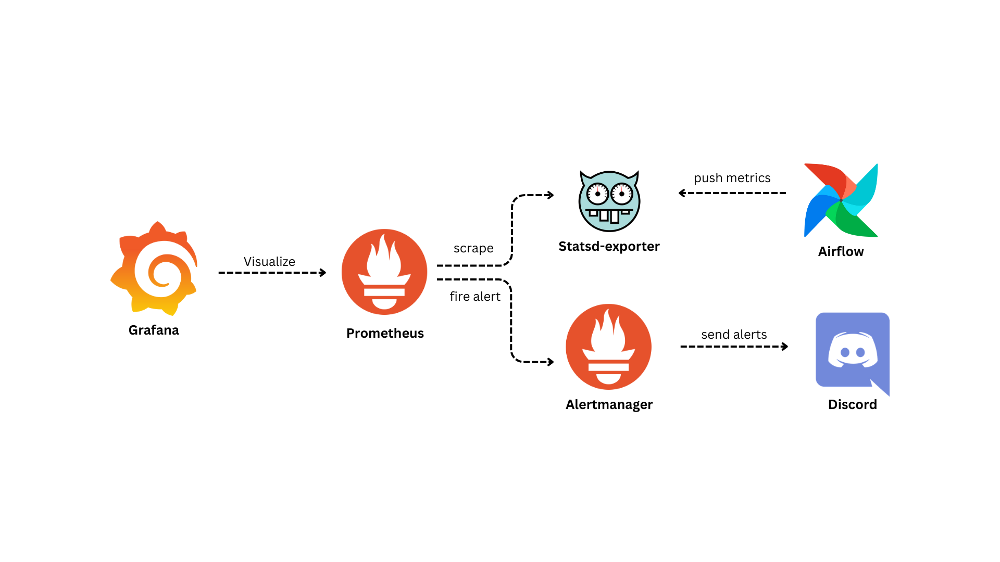

# Airflow Monitoring and Alerting

<p align=center>
    
</p>

<p align=center>
    <a href="https://github.com/data-burst/airflow-monitoring-and-alerting/graphs/contributors">
    
    </a>
    <a href="https://github.com/data-burst/airflow-monitoring-and-alerting/LICENSE"> 
    
</a>
</p>

## Table of Contents 🏗️

- [Airflow Monitoring and Alerting](#airflow-monitoring-and-alerting)
  - [Table of Contents 🏗️](#table-of-contents-️)
  - [Project Description 🌱](#project-description-)
  - [Project Usage 🧑‍💻](#project-usage-)
  - [Integration Steps for Airflow Monitoring Stack in Existing Setup :speech\_balloon:](#integration-steps-for-airflow-monitoring-stack-in-existing-setup-speech_balloon)
  - [Contributing 👥](#contributing-)
  - [License 📄](#license-)

## Project Description 🌱

This project offers a robust monitoring stack for Apache Airflow, encapsulated within Docker. It harnesses the capabilities of Prometheus, Grafana, StatsD, and Alertmanager to deliver real-time monitoring and visualization of your Airflow workflows.

The stack is designed for easy deployment and configuration. Grafana dashboards are automatically provisioned, enabling immediate visualization of key metrics from your Airflow instance. The project supports the addition of new dashboards by simply adding the corresponding JSON file to the `config_files/grafana/var/lib/grafana/dashboards` directory.

In addition to this, Alertmanager is incorporated into the stack to group alerts and send notifications to a Discord or Slack channel using a webhook token. This ensures you are always informed about the status of your workflows and can respond promptly to any issues.

## Project Usage 🧑‍💻

**Important Tip**:

Before you can use the project, based on [Airflow's documentation](https://airflow.apache.org/docs/apache-airflow/stable/howto/docker-compose/index.html#setting-the-right-airflow-user), you need to ensure that Airflow has the correct permissions for the required directories. To do this, execute the following commands in the directory where your `docker-compose.yaml` file is located:

```bash
mkdir -p ./dags ./logs ./plugins ./config
echo -e "AIRFLOW_UID=$(id -u)" > .env
```

Deploying the project is straightforward:

1. **Clone the Repository**: Use git clone  to clone the repository onto your local machine.

    ```bash
    git clone https://github.com/data-burst/airflow-monitoring-and-alerting.git
    ```

2. Configure your Alertmanager by adding your Discord or Slack webhook token to the config_files/alertmanager/config.yaml file. Replace `<your_discord_webhook>` for Discord and `<your_slack_webhook>` for Slack. Additionally, update `<#your_slack_channel_name>` with your Slack channel name, for example, `#my_channel_name`."

3. **Start the Services**: Navigate to the project directory and use the following command to initiate all services in detached mode.

   ```bash
   docker compose up -d
   ```

   **P.S.**: Starting from Docker Compose V2, the docker compose command is integrated directly into the Docker CLI and Docker Engine1. This replaces the docker-compose feature from Docker Compose V11. Therefore, if you’re using Docker Compose V2 or later, you should be able to use the `docker compose` command, otherwise use `docker-compose`.

4. **Enjoy**: That’s it! Your Apache Airflow monitoring stack is now operational.

## Integration Steps for Airflow Monitoring Stack in Existing Setup :speech_balloon:

To integrate the monitoring stack for Apache Airflow into an existing setup with Airflow and Prometheus, follow these instructions:

1. **Install the required components**: Make sure you have Airflow and Prometheus and Grafana installed and configured in your environment.

2. **Mapping the configuration files**: Copy the contents of the `config_files/statsd/statsd.yaml` file from the monitoring project repository into your own Statsd configuration directory.

3. **Modify Airflow configuration**: Open your Airflow configuration file (airflow.cfg) and add the following lines:

   ```bash
   AIRFLOW__METRICS__STATSD_ON: "True"
   AIRFLOW__METRICS__STATSD_HOST: "statsd-exporter"
   AIRFLOW__METRICS__STATSD_PORT: "9125"
   AIRFLOW__METRICS__STATSD_PREFIX: "airflow"
   ```
    🔍️ Adjust the values based on your specific configuration.

4. **Configure Prometheus**: In your Prometheus configuration file (prometheus.yml), add the scrape configuration for the StatsD exporter:

    ```bash
    - job_name: 'statsd-exporter'
      scrape_interval: 15s
      static_configs:
        - targets:
          - 'statsd-exporter:9102'
    ```
    🔍️ Save the file after making the changes.

5. **Copy Grafana Dashboard JSON file**: From the `airflow-monitoring-and-alerting` repository, navigate to the `config_files/grafana/var/lib/grafana/dashboards` directory. Copy the JSON files of the desired dashboards you want to add to your Grafana instance.

*Note*: The specific directory path may vary depending on your Grafana setup.

By following these steps, you will integrate the monitoring stack from the `airflow-monitoring-and-alerting` repository into your existing Airflow and Prometheus setup. Make sure to adjust the configurations and paths according to your environment.

## Contributing 👥

We welcome contributions to this repository! If you’re interested in contributing, please take a look at our [CONTIRIBUTION.md](./CONTRIBUTING.md) file for more information on how to get started. We look forward to collaborating with you!

## License 📄

This repository is licensed under the MIT License, which is a permissive open-source license that allows for reuse and modification of the code with few restrictions. You can find the full text of the license in [this](./LICENSE) file.
