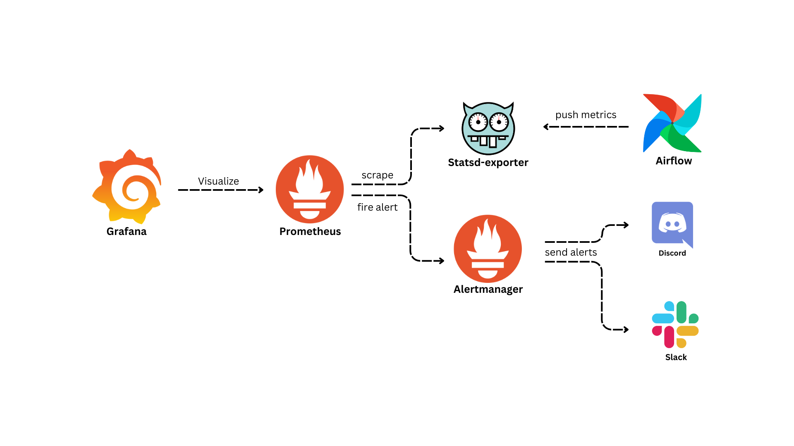

# Airflow Monitoring and Alerting

<p align=center>
    
</p>

<p align=center>
    <a href="https://github.com/data-burst/airflow_monitoring_and_alerting/graphs/contributors">
    
    </a>
    <a href="https://github.com/data-burst/airflow_monitoring_and_alerting/LICENSE"> 
    
</a>
</p>

## Table of Contents 🏗️

- [Airflow Monitoring and Alerting](#airflow-monitoring-and-alerting)
  - [Table of Contents 🏗️](#table-of-contents-️)
  - [Project Description 🌱](#project-description-)
  - [Project Usage 🧑‍💻](#project-usage-)
  - [Contributing 👥](#contributing-)
  - [License 📄](#license-)

## Project Description 🌱

This project offers a robust monitoring stack for Apache Airflow, encapsulated within Docker. It harnesses the capabilities of Prometheus, Grafana, StatsD, and Alertmanager to deliver real-time monitoring and visualization of your Airflow workflows.

The stack is designed for easy deployment and configuration. Grafana dashboards are automatically provisioned, enabling immediate visualization of key metrics from your Airflow instance. The project supports the addition of new dashboards by simply adding the corresponding JSON file to the config_files/grafana/var/lib/grafana/dashboards directory.

In addition to this, Alertmanager is incorporated into the stack to group alerts and send notifications to a Discord channel using a webhook token. This ensures you are always informed about the status of your workflows and can respond promptly to any issues.

## Project Usage 🧑‍💻

Deploying the project is straightforward:

1. **Clone the Repository**: Use git clone  to clone the repository onto your local machine.

    ```bash
    git clone https://github.com/data-burst/airflow_monitoring_and_alerting.git
    ```

2. Add your Discord webhook token to `config_files/alertmanager/config.yaml` file and replace it with `<your_discord_webhook>`.

3. **Start the Services**: Navigate to the project directory and use the following command to initiate all services in detached mode.

   ```bash
   docker compose up -d
   ```

   **P.S.**: Starting from Docker Compose V2, the docker compose command is integrated directly into the Docker CLI and Docker Engine1. This replaces the docker-compose feature from Docker Compose V11. Therefore, if you’re using Docker Compose V2 or later, you should be able to use the `docker compose` command, otherwise use `docker-compose`.

4. **Enjoy**: That’s it! Your Apache Airflow monitoring stack is now operational.

## Contributing 👥

We welcome contributions to this repository! If you’re interested in contributing, please take a look at our [CONTIRIBUTION.md](https://github.com/data-burst/airflow_monitoring_and_alerting/blob/master/CONTRIBUTING.md) file for more information on how to get started. We look forward to collaborating with you!

## License 📄

This repository is licensed under the MIT License, which is a permissive open-source license that allows for reuse and modification of the code with few restrictions. You can find the full text of the license in [this](https://github.com/data-burst/airflow_monitoring_and_alerting/license) file.
